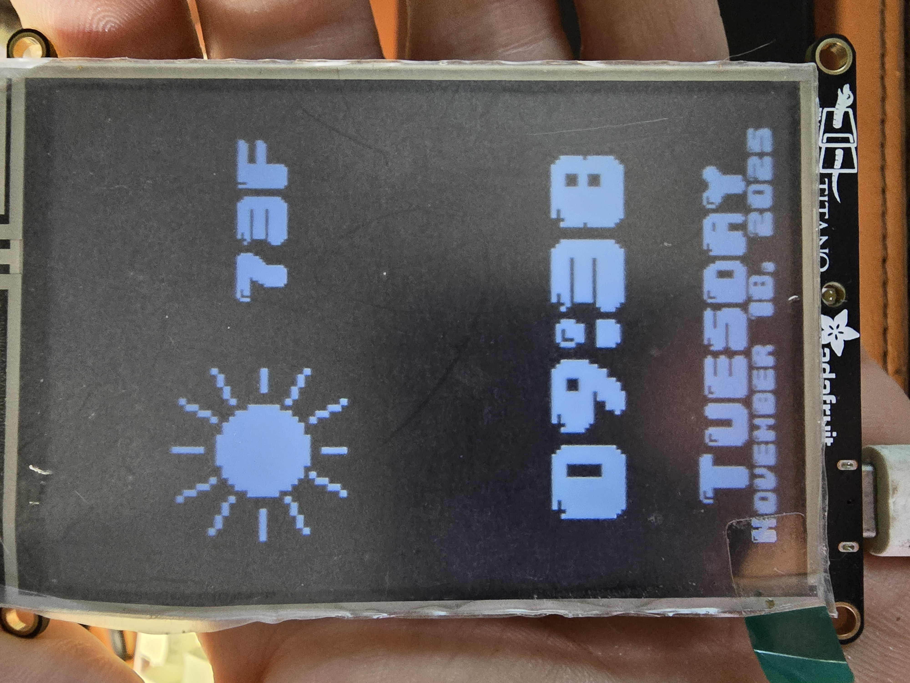

=============================

A portrait-mode weather and clock display built using CircuitPython on the Adafruit PyPortal Titano.
This project demonstrates embedded firmware development, Wi-Fi API integration, display rendering, and real-world hardware interaction.

---

## Overview

## Why this project exists

This project started as a way to learn real embedded development on hardware that is not heavily documented. The PyPortal Titano has a larger portrait display and slightly different constraints than the more common PyPortal examples. Building this weather and clock display required combining CircuitPython, Wi-Fi APIs, UI layout work, and sensor handling into a single, working device.

It now serves as a reference for anyone who wants a concrete example of a small but complete firmware project: it talks to external services, renders a usable interface, and runs on real hardware on a desk, not just in a simulator.

This firmware turns the PyPortal Titano into a desk display showing:

| Component | Description |
|----------|------------|
| Time | Large digital clock with smooth refresh |
| Date | Full weekday and MM/DD format |
| Weather | Temp and icon from Open-Meteo API |
| Brightness | Automatic dimming via onboard light sensor |
| Internet connectivity | Periodic refresh and graceful offline fallback |
| Portrait UI | Optimized for 480×320 resolution |

---

## Example

---

## Hardware

| Component | Description |
|-----------|-------------|
| Adafruit PyPortal Titano | 480×320 touchscreen microcontroller |
| ESP32 AirLift | Wi-Fi coprocessor for HTTPS requests |
| Light sensor | Controls automatic screen brightness |
| Weather BMP sprites | 32×32px icons |
| 04b30-20.bdf | Pixel font used for display text |

---

## Repository Structure

pyportal-titano-weather-clock/
├── code.py
├── .gitignore
├── README.md
├── secrets_example.py
├── pyportal_titano_weather_clock_example.jpg
├── fonts/
│   └── 04b30-20.bdf
└── weather_icons_32x32_9.bmp

---

## Setup
The steps below assume that CircuitPython is already installed on the PyPortal Titano and that the board appears as the CIRCUITPY drive on your computer.

### 1. Install CircuitPython
Install CircuitPython for the PyPortal Titano:
https://circuitpython.org/board/pyportal_titano/

### 2. Copy the project files to CIRCUITPY
Place the following on the board:

code.py
weather_icons_32x32_9.bmp
/fonts/04b30-20.bdf

### 3. Create secrets.py

secrets = {
    "ssid": "YOUR_WIFI_NAME",
    "password": "YOUR_WIFI_PASSWORD",
    "timezone": "Region/City"
}

---

## Timezone Format (IANA Standard)

Examples:

America/New_York
America/Chicago
Europe/London
Asia/Tokyo
Australia/Sydney

Full timezone list:
https://en.wikipedia.org/wiki/List_of_tz_database_time_zones

---

## Skills demonstrated

- CircuitPython firmware development on microcontroller hardware  
- Integration with external REST APIs for time and weather data  
- Display layout and rendering for a constrained portrait screen  
- Light sensor-based control and hardware abstraction  
- Debugging of network, timing, and rendering issues on a physical device  
- Secure handling of configuration and credentials with secrets.py  
- Use of Git, GitHub topics, releases, and project structure for a small embedded project

---

## Roadmap

| Feature | Status |
|---------|--------|
| Touch settings menu | Planned |
| Offline visual indicator | Planned |
| Minimal UI mode | Planned |
| Theme variations | Planned |

---

## Contributing
Pull requests and issues are welcome.

---

## License
MIT License

---

## Acknowledgements
Adafruit Industries for hardware reference docs and CircuitPython examples.

---

## Project metadata

- License: see the `LICENSE` file in the repository root (MIT)  
- Change history: see `CHANGELOG.md` for released versions  
- Stable version: the latest tagged release is `v1.0.0`
