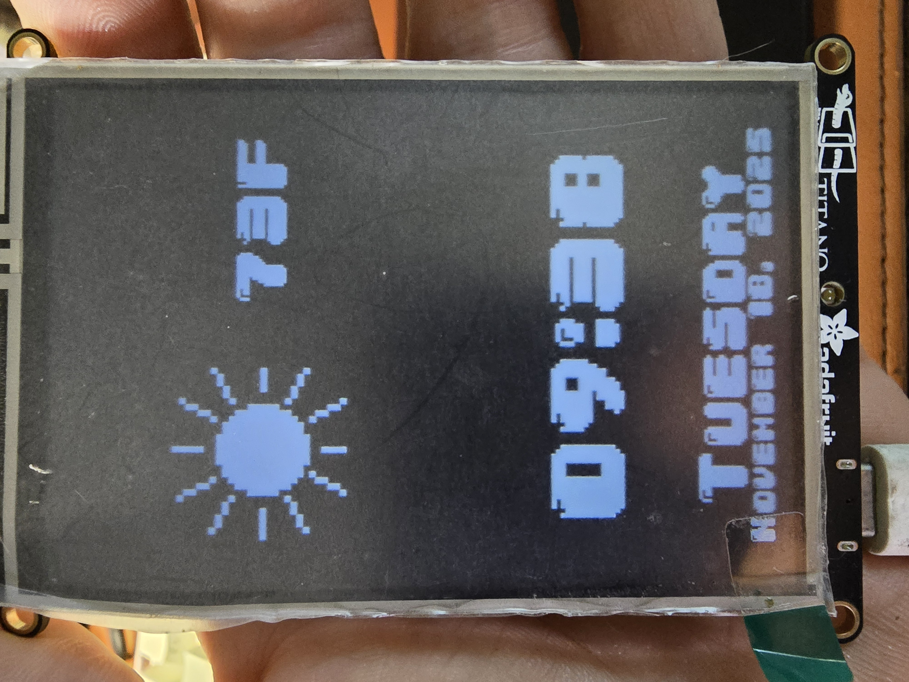

# PyPortal Titano — Ambient Dashboard

A modular, state-driven ambient desk display built on CircuitPython for the Adafruit PyPortal Titano. Evolved from a weather clock into a full 7-page ambient information console.



---

## Overview

This firmware turns the PyPortal Titano into a polished desk appliance that auto-rotates through seven full-screen information pages, responds to physical buttons (2-button or 3-button wiring), and degrades gracefully when offline. It is designed to feel like an intentional embedded product — not a weekend script.

| Page | Content |
|------|---------|
| **Clock / Weather** | Large time, date, current temperature, weather icon |
| **Forecast** | Next 5 hourly periods — icon + label + temp |
| **Calendar** | Next 3 events from your Google Calendar (via bridge)\* |
| **Tasks** | Top 5 tasks from Google Tasks (via bridge)\* |
| **Timer** | 1 / 5 / 10 / 25 min countdown with alert |
| **Alarm** | Single daily alarm — hour/minute editable |
| **Status** | Wi-Fi, IP, sync ages, brightness, build info |

\* On low-memory PyPortal builds, Calendar and Tasks pages may be disabled to prevent `MemoryError`.

---

## Hardware

| Component | Notes |
|-----------|-------|
| Adafruit PyPortal Titano | 480×320 portrait display + ESP32 AirLift Wi-Fi |
| 2 or 3 momentary pushbuttons | Recommended: D3 (BACK), D4 (NEXT). Optional third button for HOME if available. |
| Small speaker | Onboard; used for click / timer / alarm sounds |
| Light sensor | Onboard; drives auto-brightness |

See [`docs/hardware-wiring.md`](docs/hardware-wiring.md) for wiring diagrams and pin details.

---

## Interaction Model

Three physical buttons control everything:

| Button | Normal navigation | Focused context (timer/alarm edit) |
|--------|-------------------|------------------------------------|
| **BACK** | Previous page | Decrement / cancel |
| **HOME** | Return to Clock page | Confirm / start / dismiss alarm |
| **NEXT** | Next page | Increment / cycle preset |

**Ambient mode:** when idle for `MANUAL_TIMEOUT_SECS` (default 25 s), the display auto-rotates through all pages every `AMBIENT_ROTATE_SECS` (default 12 s). Any button press re-enters manual navigation mode.

---

## Setup

### 1. Install CircuitPython

Flash CircuitPython 10.x for the PyPortal Titano:
https://circuitpython.org/board/pyportal_titano/

### 2. Install required libraries

Copy the following from the [Adafruit CircuitPython Bundle](https://github.com/adafruit/Adafruit_CircuitPython_Bundle) into `CIRCUITPY/lib/`:

```
adafruit_esp32spi/
adafruit_requests.mpy
adafruit_display_text/
adafruit_bitmap_font/
adafruit_imageload/
```

### 3. Copy project files

Copy the full repo contents to the CIRCUITPY drive:

```
code.py
boot.py
settings.toml          ← you create this (see step 4)
app/
assets/
fonts/
```

### 4. Create settings.toml

Copy `settings.toml.example` to `settings.toml` and fill in your values:

```toml
CIRCUITPY_WIFI_SSID="YOUR_NETWORK"
CIRCUITPY_WIFI_PASSWORD="YOUR_PASSWORD"
TIMEZONE="America/New_York"
LATITUDE="40.1100"
LONGITUDE="-82.9300"
USE_FAHRENHEIT="true"
WEATHER_REFRESH_SECS="600"
DASHBOARD_REFRESH_SECS="300"
TIME_RESYNC_SECS="600"
AMBIENT_ROTATE_SECS="12"
MANUAL_TIMEOUT_SECS="25"
DASHBOARD_JSON_URL=""
```

**Do not commit `settings.toml` to git.** It is in `.gitignore`.

### 5. Wire buttons

Attach momentary switches between the listed GPIO pins and GND. Internal pull-ups are used; no external resistors needed.

| Function | Pin | Board label |
|----------|-----|-------------|
| BACK | D3 | GP3 |
| NEXT | D4 | GP4 |
| HOME (optional) | configure in `settings.toml` | depends on your wiring |

See [`docs/hardware-wiring.md`](docs/hardware-wiring.md) for full wiring details.

### 6. (Optional) Set up the dashboard bridge

For Calendar and Tasks pages to show real data, run the bridge service on a home server or Raspberry Pi. See [`docs/architecture.md`](docs/architecture.md) and [`bridge/dashboard_bridge.py`](bridge/dashboard_bridge.py).

---

## Configuration Reference

See [`docs/configuration.md`](docs/configuration.md) for a complete reference of all `settings.toml` keys.

---

## Audio

The onboard speaker produces three sounds:

| Sound | When |
|-------|------|
| Short click | Valid button press accepted |
| Three-tone pattern | Timer countdown complete |
| Repeating alert | Alarm triggered |

All audio is non-blocking and generated via PWM — no audio files required. The alarm and timer sounds stop immediately on any button press.

---

## Architecture

```
code.py                    ← thin entry point + main scheduler loop
boot.py                    ← CircuitPython boot config
settings.toml              ← all user config (not committed)
app/
  app_controller.py        ← state machine, page routing, input dispatch
  state.py                 ← mutable runtime state singleton
  cache.py                 ← last-known-good data (weather/cal/tasks)
  config.py                ← reads settings.toml via os.getenv()
  constants.py             ← all string enums and magic numbers
  theme.py                 ← color palette and layout metrics
  ui_helpers.py            ← label utils, font loader, formatters
  input.py                 ← debounced 3-button handler (keypad.Keys)
  audio.py                 ← non-blocking PWM tone patterns
  brightness.py            ← auto-dim via light sensor
  connectivity.py          ← Wi-Fi + HTTP (ESP32 AirLift)
  time_service.py          ← worldtimeapi.org NTP sync
  weather_service.py       ← Open-Meteo fetch + dashboard ingest
  calendar_service.py      ← dashboard calendar ingest
  tasks_service.py         ← dashboard tasks ingest
  dashboard_service.py     ← unified dashboard.json fetch + dispatch
  timer_service.py         ← local countdown timer state machine
  alarm_service.py         ← daily alarm with retrigger guard
  pages/
    base_page.py           ← abstract page interface
    hero_page.py           ← clock + weather (main ambient view)
    forecast_page.py       ← hourly forecast
    calendar_page.py       ← upcoming events
    tasks_page.py          ← task list
    timer_page.py          ← countdown timer
    alarm_page.py          ← alarm config + dismiss
    status_page.py         ← system diagnostics
assets/
  weather_icons_32x32_9.bmp
fonts/
  04b30-20.bdf
  daydream20.bdf
bridge/
  dashboard_bridge.py      ← server-side Google Calendar/Tasks bridge
docs/
  architecture.md
  configuration.md
  hardware-wiring.md
```

See [`docs/architecture.md`](docs/architecture.md) for a full system description.

---

## Dashboard Feed

Calendar and Tasks data flows through an external bridge service — the PyPortal never authenticates to Google directly. The device fetches a compact JSON endpoint:

```json
{
  "generated_at": "2026-04-15T08:00:00-04:00",
  "timezone": "America/New_York",
  "weather": {
    "current_temp": 58,
    "weather_code": 2,
    "forecast": [
      {"label": "9 AM", "temp": 58, "code": 2}
    ]
  },
  "calendar": [
    {"time": "9:30 AM", "title": "Call with Jim"}
  ],
  "tasks": [
    {"title": "Update README", "priority": "high"}
  ]
}
```

If `DASHBOARD_JSON_URL` is empty, weather is fetched directly from Open-Meteo; Calendar and Tasks pages show "No data".

---

## Known Limitations

- Calendar and Tasks require running the bridge service on a separate machine
- Timer and Alarm state is not persisted across reboots
- No touchscreen input (buttons only)
- Single alarm slot only
- Open-Meteo hourly forecast is limited to the current day

---

## Roadmap

| Feature | Status |
|---------|--------|
| Touch gesture navigation | Planned |
| NV-RAM alarm persistence | Planned |
| Multiple alarm slots | Planned |
| Theme switcher | Planned |
| Bridge service Docker image | Planned |
| OTA firmware update indicator | Planned |

---

## Contributing

Pull requests and issues are welcome. Please open an issue before large changes.

---

## License

MIT — see `LICENSE`.

---

## Acknowledgements

- [Adafruit Industries](https://adafruit.com) for hardware, CircuitPython, and library ecosystem
- [Open-Meteo](https://open-meteo.com) for the free weather API
- [worldtimeapi.org](https://worldtimeapi.org) for timezone-aware NTP
